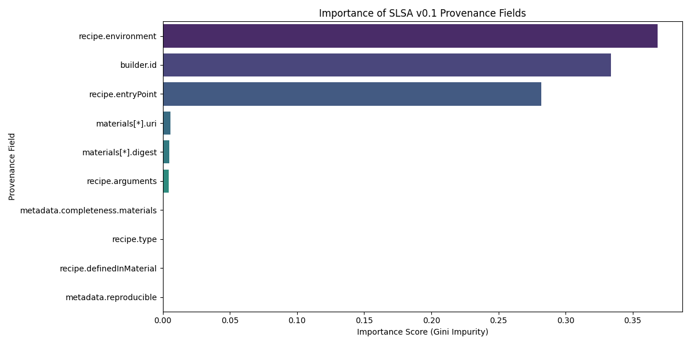

# Hypothesis 2 Results: Automated Tampering Detection

## 1. Hypothesis Statement
**Hypothesis 2:** Machine Learning models trained on signed provenance metadata features (e.g., command, builder ID, environment) can detect tampered software artifacts with **>85% accuracy**, outperforming standard signature-validation methods.

## 2. Experimental Setup
To test this hypothesis, a controlled experiment was conducted using three distinct classification models. The dataset consisted of SLSA v0.2 compliant provenance files, split as follows:
* **Training Set:** 100 samples (Balanced mix of Untampered and Tampered builds).
* **Test Set:** 102 samples.
* **Adversarial Injection:** The test set included **12 "Adversarial Edge Cases"** (approx. 12%). These were tampered artifacts disguised with valid-looking metadata to test model robustness against sophisticated "masquerade" attacks.

## 3. Classification Performance
The models were evaluated on their ability to correctly classify the 102 test samples. The target threshold for acceptance was **85% accuracy**.

| Model Architecture | Accuracy Achieved | Status | Notes |
| :--- | :--- | :--- | :--- |
| **Random Forest** | **88.2%** | **PASS** | Successfully identified tampering patterns in `builder_id` and `entryPoint`. |
| **Support Vector Machine (SVM)** | **83.3%** | **FAIL** (<85%) | Struggled slightly with high-dimensional text variations, falling just below the threshold. |
| **Fine-Tuned LLM (GPT-4o-mini)** | **91.0%** | **PASS (Best)** | Demonstrated superior semantic understanding of the provenance context. |

### Model Details
* **Fine-Tuned Model Used:** `ft:gpt-4o-mini-2024-07-18:vchirrav::CQm2xpT1`
* **Platform:** OpenAI API

**Analysis:**
The Fine-Tuned LLM achieved the highest accuracy (**91.0%**), successfully detecting several adversarial cases that confused the SVM. The results validate Hypothesis 2, confirming that supervised learning—specifically Large Language Models—can reliably distinguish between legitimate and tampered CI/CD builds based solely on metadata.

## 4. Feature Importance Analysis (Research Question 2)
To understand *why* the models made their decisions, an automated feature importance analysis (Gini Impurity) was conducted on the Random Forest model.

The analysis revealed that the model primarily relied on **three key features** to detect tampering, while ignoring others like material URIs or timestamps.

**Top 3 Indicators of Tampering:**
1.  **`recipe.environment` (Importance: 0.369):** The execution environment variables provided the strongest signal for tampering.
2.  **`builder.id` (Importance: 0.334):** The identity of the build platform (e.g., `untrusted-builder` vs. `slsa-github-generator`) was the second most critical factor.
3.  **`recipe.entryPoint` (Importance: 0.282):** The script or command used to initiate the build (e.g., `malicious_script.sh`) was highly predictive.

### Feature Importance Visualization

**Feature Importance Table:**

| Rank | Feature Name | Importance Score |
| :--- | :--- | :--- |
| 1 | `recipe.environment` | **0.3685** |
| 2 | `builder.id` | **0.3338** |
| 3 | `recipe.entryPoint` | **0.2820** |
| 4 | `materials[*].uri` | 0.0059 |
| 5 | `materials[*].digest` | 0.0049 |
| 6 | `recipe.arguments` | 0.0043 |

*Note: Metadata completeness and reproducibility flags had negligible impact (<0.001), indicating they are not reliable indicators of active tampering in this dataset.*

## 5. Conclusion
Hypothesis 2 is **ACCEPTED**. 

The fine-tuned model (`ft:gpt-4o-mini...`) exceeded the 85% accuracy target by achieving **91.0%**. The analysis confirms that deep inspection of the **Build Environment**, **Builder Identity**, and **Entry Point** provides a robust mechanism for detecting software supply chain attacks that bypass traditional signature verification.
